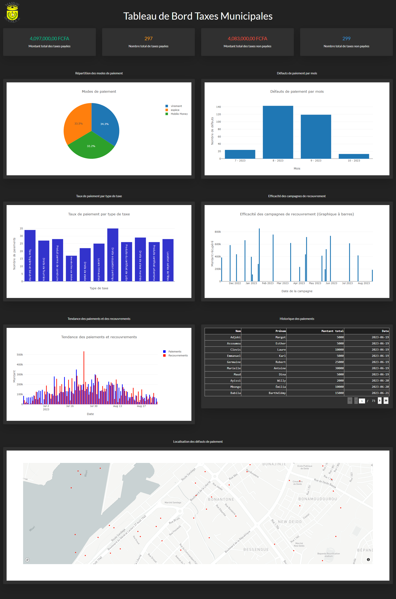

# Municipal-Tax-Management-Dashboard-App

Interactive dashboard for real-time monitoring of municipal tax payments. Built with Flask (API), Dash (GUI) and Plotly (charts). Displays key metrics like paid/unpaid amounts, trends, campaign efficiency. Fetches data from Flask API connected to MySQL. Includes fake data generator. Auto-refreshes every 10 sec. Responsive design. 

# Municipal Tax Management Dashboard

This project consists of a dashboard for real-time visualization of municipal tax management data from Douala 3rd district city hall.

## Dashboard Overview

The dashboard displays several charts and metrics to monitor in real-time:

- Total amount of paid and unpaid taxes
- Number of paid and unpaid taxes  
- Breakdown of payment methods
- Payment defaults per month
- Payment rate per tax type
- Recovery campaign efficiency
- Payment and recovery trends
- Payment history
- Geographical location of payment defaults



## Features  

The key features of the dashboard are:

- **Real-time update**: Data is fetched in real-time from the Flask API to provide up-to-date metrics.

- **Interactive visualizations**: Charts are built with Plotly and Dash to enable interactive experience (hover, zoom etc).

- **Responsive design**: The dashboard adapts to desktop and mobile screens. 

- **Dark theme**: The interface uses a dark color palette for improved visual comfort.

## Technologies Used

- **Python**: For fake data injection script, Flask API and Dash dashboard.

- **MySQL**: For data storage.

- **Flask**: Python framework for building the REST API.

- **Dash**: Python library for creating interactive web dashboards.

- **Plotly**: JavaScript graphing library for visualization.

- **Bootstrap**: CSS framework for styling and responsive layout.

## Installation

**Step 1**: Clone the GitHub repository

```bash
https://github.com/lemale237/Municipal-Tax-Management-Dashboard-App.git
```

**Step 2: Creating a virtual environment and installing dependencies

```bash
cd Municipal-Tax-Management-Dashboard-App
python3 -m venv venv
source venv/bin/activate  
pip install -r requirements.txt
```
**Step 3** : Run the script to generate dummy data

```bash
python script.py
```
**Step 4**: Start the Flask API

```bash
python API.py
```

**Step 5**: Start the Dash dashboard

```bash
python dashboard.py
```

The dashboard can be accessed at [http://localhost:8050/](http://localhost:8050/)

Author

Author's name - kamtsa.aubin@gmail.com

Project link: [https://github.com/votre-compte/tableau-bord-taxes-municipales](https://github.com/lemale237/Municipal-Tax-Management-Dashboard-App.git)

Licence

This project is licensed under the MIT license - see the LICENSE file for details.
